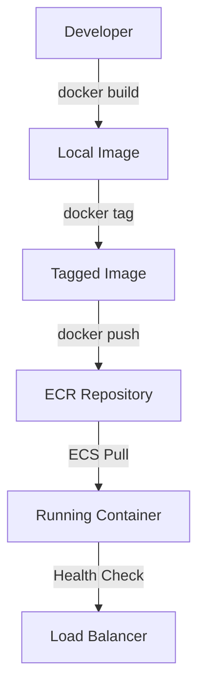

# 🚀 HƯỚNG DẪN PHÁT TRIỂN AWS WORKSHOP STUDIO - PHẦN 2

## 5. Phát triển nội dung

### 5.1 Module Development Framework

**📚 Module Template Structure:**
```markdown
---
title: "Module 1: Container Fundamentals"
weight: 20
duration: "45 minutes"
objectives:
  - "Understand container concepts"
  - "Build and test Docker images"
  - "Push images to Amazon ECR"
---

# Module 1: Container Fundamentals

## 🎯 Learning Objectives
By the end of this module, you will:
- ✅ Understand containerization principles
- ✅ Build optimized Docker images
- ✅ Configure Amazon ECR repositories
- ✅ Implement container security best practices

## 📋 Prerequisites Check
Before starting, ensure you have:
- [ ] Docker installed and running
- [ ] AWS CLI configured
- [ ] Text editor available

## 🏗️ Architecture Overview


In this module, we'll work with:
```
┌─────────────────────────────────────────────────────────────┐
│                    Development Environment                   │
├─────────────────────────────────────────────────────────────┤
│  Local Docker          │         Amazon ECR                 │
│  ├── Build Image       │         ├── Create Repository      │
│  ├── Test Container    │         ├── Push Image             │
│  └── Tag for ECR       │         └── Manage Lifecycle       │
└─────────────────────────────────────────────────────────────┘
```

## 🛠️ Hands-on Exercise 1: Build Your First Container

### Step 1: Create Application Code
```javascript
// app.js - Simple Node.js application
const express = require('express');
const app = express();
const port = 3000;

app.get('/', (req, res) => {
  res.json({
    message: 'Hello from ECS Workshop!',
    timestamp: new Date().toISOString(),
    hostname: require('os').hostname()
  });
});

app.get('/health', (req, res) => {
  res.status(200).json({ status: 'healthy' });
});

app.listen(port, '0.0.0.0', () => {
  console.log(`App running on port ${port}`);
});
```

### Step 2: Create Package Configuration
```json
{
  "name": "ecs-workshop-app",
  "version": "1.0.0",
  "description": "Sample app for ECS workshop",
  "main": "app.js",
  "scripts": {
    "start": "node app.js",
    "test": "echo \"No tests specified\""
  },
  "dependencies": {
    "express": "^4.18.0"
  }
}
```

### Step 3: Create Optimized Dockerfile
```dockerfile
# Use multi-stage build for optimization
FROM node:18-alpine AS builder

# Set working directory
WORKDIR /app

# Copy package files
COPY package*.json ./

# Install dependencies
RUN npm ci --only=production

# Production stage
FROM node:18-alpine AS production

# Create non-root user
RUN addgroup -g 1001 -S nodejs && \
    adduser -S nextjs -u 1001

# Set working directory
WORKDIR /app

# Copy application code
COPY --from=builder /app/node_modules ./node_modules
COPY app.js ./

# Change ownership
RUN chown -R nextjs:nodejs /app
USER nextjs

# Expose port
EXPOSE 3000

# Health check
HEALTHCHECK --interval=30s --timeout=3s --start-period=5s --retries=3 \
  CMD curl -f http://localhost:3000/health || exit 1

# Start application
CMD ["npm", "start"]
```

### Step 4: Build and Test Container
```bash
# Build the Docker image
docker build -t ecs-workshop-app:v1.0 .

# Run container locally for testing
docker run -d -p 3000:3000 --name test-app ecs-workshop-app:v1.0

# Test the application
curl http://localhost:3000
curl http://localhost:3000/health

# Check container logs
docker logs test-app

# Stop and remove test container
docker stop test-app
docker rm test-app
```

## 🔍 Validation Checkpoint

**✅ Verify your progress:**
```bash
#!/bin/bash
# validate-module1.sh

echo "🔍 Validating Module 1 Progress..."

# Check if Docker image exists
if docker images | grep -q "ecs-workshop-app"; then
    echo "✅ Docker image built successfully"
else
    echo "❌ Docker image not found"
    exit 1
fi

# Check image size (should be < 100MB for optimized build)
IMAGE_SIZE=$(docker images ecs-workshop-app:v1.0 --format "table {{.Size}}" | tail -n 1)
echo "📊 Image size: $IMAGE_SIZE"

echo "✅ Module 1 validation complete!"
```

## 🎯 Key Takeaways
- **Multi-stage builds** reduce image size significantly
- **Non-root users** improve container security
- **Health checks** enable better monitoring
- **Proper tagging** facilitates version management

## 🚀 Next Steps
In Module 2, we'll push this image to Amazon ECR and deploy it to ECS!

---
**💡 Pro Tip:** Always test containers locally before pushing to registries.
```

### 5.2 Interactive Elements và Rich Content

**🎨 Visual Elements Integration:**
```markdown
## Interactive Diagrams

### Architecture Flow


### Cost Tracking Widget
```html
<!-- Embedded cost tracker -->
<div class="cost-tracker">
  <h4>💰 Current Workshop Cost</h4>
  <div class="cost-display">
    <span class="amount">$2.45</span>
    <span class="currency">USD</span>
  </div>
  <div class="breakdown">
    <div>EC2 Instances: $1.20</div>
    <div>Load Balancer: $0.80</div>
    <div>Data Transfer: $0.45</div>
  </div>
</div>
```

### Progress Indicator
```html
<div class="progress-container">
  <div class="progress-bar">
    <div class="progress-fill" style="width: 40%"></div>
  </div>
  <span class="progress-text">Module 1 of 3 Complete (40%)</span>
</div>
```
```

**🔧 Code Validation Blocks:**
```markdown
## Automated Validation

### Command Validation
```bash
# This command will be automatically validated
aws ecr describe-repositories --repository-names ecs-workshop-app
```

**Expected Output:**
```json
{
    "repositories": [
        {
            "repositoryArn": "arn:aws:ecr:us-east-1:123456789012:repository/ecs-workshop-app",
            "registryId": "123456789012",
            "repositoryName": "ecs-workshop-app",
            "repositoryUri": "123456789012.dkr.ecr.us-east-1.amazonaws.com/ecs-workshop-app"
        }
    ]
}
```

### Validation Script
```bash
#!/bin/bash
# Auto-validation for participant progress

REPO_NAME="ecs-workshop-app"
REGION=$(aws configure get region)

# Check if ECR repository exists
if aws ecr describe-repositories --repository-names $REPO_NAME --region $REGION &>/dev/null; then
    echo "✅ ECR repository created successfully"
    
    # Check if image is pushed
    IMAGE_COUNT=$(aws ecr list-images --repository-name $REPO_NAME --region $REGION --query 'length(imageIds)')
    if [ "$IMAGE_COUNT" -gt 0 ]; then
        echo "✅ Docker image pushed to ECR"
    else
        echo "⚠️  ECR repository exists but no images found"
    fi
else
    echo "❌ ECR repository not found"
    echo "💡 Run: aws ecr create-repository --repository-name $REPO_NAME"
fi
```

### 5.3 Content Quality Standards

**📝 Writing Guidelines:**

1. **Clear Instructions:**
   - Use numbered steps for sequential tasks
   - Include expected outputs for commands
   - Provide troubleshooting for common issues

2. **Visual Hierarchy:**
   - Use consistent heading levels
   - Include relevant diagrams and screenshots
   - Highlight important information with callouts

3. **Code Quality:**
   - Provide complete, working code examples
   - Include comments explaining complex logic
   - Use consistent formatting and indentation

**🎯 Content Validation Checklist:**
```markdown
## Content Quality Checklist

### Technical Accuracy
- [ ] All commands tested and verified
- [ ] Code examples are complete and functional
- [ ] Screenshots are current and accurate
- [ ] Links are valid and accessible

### User Experience
- [ ] Instructions are clear and unambiguous
- [ ] Estimated times are realistic
- [ ] Prerequisites are clearly stated
- [ ] Troubleshooting guidance provided

### Accessibility
- [ ] Alt text provided for images
- [ ] Color is not the only way to convey information
- [ ] Text contrast meets accessibility standards
- [ ] Content is screen reader friendly

### Consistency
- [ ] Terminology used consistently
- [ ] Formatting follows style guide
- [ ] Navigation is intuitive
- [ ] Voice and tone are consistent
```

---

## 6. Thiết lập Infrastructure

### 6.1 CloudFormation Template Design

**🏗️ Main Infrastructure Template (templates/infrastructure.yaml):**
```yaml
AWSTemplateFormatVersion: '2010-09-09'
Description: 'ECS Workshop Infrastructure - Complete setup for containerized applications'

Parameters:
  EnvironmentName:
    Description: Environment name prefix for resources
    Type: String
    Default: ECSWorkshop
    
  VpcCIDR:
    Description: CIDR block for VPC
    Type: String
    Default: 10.192.0.0/16
    
  PublicSubnet1CIDR:
    Description: CIDR block for public subnet in AZ1
    Type: String
    Default: 10.192.10.0/24
    
  PublicSubnet2CIDR:
    Description: CIDR block for public subnet in AZ2
    Type: String
    Default: 10.192.11.0/24
    
  PrivateSubnet1CIDR:
    Description: CIDR block for private subnet in AZ1
    Type: String
    Default: 10.192.20.0/24
    
  PrivateSubnet2CIDR:
    Description: CIDR block for private subnet in AZ2
    Type: String
    Default: 10.192.21.0/24

Resources:
  # VPC Configuration
  VPC:
    Type: AWS::EC2::VPC
    Properties:
      CidrBlock: !Ref VpcCIDR
      EnableDnsHostnames: true
      EnableDnsSupport: true
      Tags:
        - Key: Name
          Value: !Sub ${EnvironmentName}-VPC
        - Key: Workshop
          Value: ECS-Container-Workshop

  # Internet Gateway
  InternetGateway:
    Type: AWS::EC2::InternetGateway
    Properties:
      Tags:
        - Key: Name
          Value: !Sub ${EnvironmentName}-IGW

  InternetGatewayAttachment:
    Type: AWS::EC2::VPCGatewayAttachment
    Properties:
      InternetGatewayId: !Ref InternetGateway
      VpcId: !Ref VPC

  # Public Subnets
  PublicSubnet1:
    Type: AWS::EC2::Subnet
    Properties:
      VpcId: !Ref VPC
      AvailabilityZone: !Select [ 0, !GetAZs '' ]
      CidrBlock: !Ref PublicSubnet1CIDR
      MapPublicIpOnLaunch: true
      Tags:
        - Key: Name
          Value: !Sub ${EnvironmentName}-Public-Subnet-AZ1

  PublicSubnet2:
    Type: AWS::EC2::Subnet
    Properties:
      VpcId: !Ref VPC
      AvailabilityZone: !Select [ 1, !GetAZs '' ]
      CidrBlock: !Ref PublicSubnet2CIDR
      MapPublicIpOnLaunch: true
      Tags:
        - Key: Name
          Value: !Sub ${EnvironmentName}-Public-Subnet-AZ2

  # Private Subnets
  PrivateSubnet1:
    Type: AWS::EC2::Subnet
    Properties:
      VpcId: !Ref VPC
      AvailabilityZone: !Select [ 0, !GetAZs '' ]
      CidrBlock: !Ref PrivateSubnet1CIDR
      Tags:
        - Key: Name
          Value: !Sub ${EnvironmentName}-Private-Subnet-AZ1

  PrivateSubnet2:
    Type: AWS::EC2::Subnet
    Properties:
      VpcId: !Ref VPC
      AvailabilityZone: !Select [ 1, !GetAZs '' ]
      CidrBlock: !Ref PrivateSubnet2CIDR
      Tags:
        - Key: Name
          Value: !Sub ${EnvironmentName}-Private-Subnet-AZ2

  # NAT Gateways
  NatGateway1EIP:
    Type: AWS::EC2::EIP
    DependsOn: InternetGatewayAttachment
    Properties:
      Domain: vpc

  NatGateway2EIP:
    Type: AWS::EC2::EIP
    DependsOn: InternetGatewayAttachment
    Properties:
      Domain: vpc

  NatGateway1:
    Type: AWS::EC2::NatGateway
    Properties:
      AllocationId: !GetAtt NatGateway1EIP.AllocationId
      SubnetId: !Ref PublicSubnet1

  NatGateway2:
    Type: AWS::EC2::NatGateway
    Properties:
      AllocationId: !GetAtt NatGateway2EIP.AllocationId
      SubnetId: !Ref PublicSubnet2

  # Route Tables
  PublicRouteTable:
    Type: AWS::EC2::RouteTable
    Properties:
      VpcId: !Ref VPC
      Tags:
        - Key: Name
          Value: !Sub ${EnvironmentName}-Public-Routes

  DefaultPublicRoute:
    Type: AWS::EC2::Route
    DependsOn: InternetGatewayAttachment
    Properties:
      RouteTableId: !Ref PublicRouteTable
      DestinationCidrBlock: 0.0.0.0/0
      GatewayId: !Ref InternetGateway

  PublicSubnet1RouteTableAssociation:
    Type: AWS::EC2::SubnetRouteTableAssociation
    Properties:
      RouteTableId: !Ref PublicRouteTable
      SubnetId: !Ref PublicSubnet1

  PublicSubnet2RouteTableAssociation:
    Type: AWS::EC2::SubnetRouteTableAssociation
    Properties:
      RouteTableId: !Ref PublicRouteTable
      SubnetId: !Ref PublicSubnet2

  PrivateRouteTable1:
    Type: AWS::EC2::RouteTable
    Properties:
      VpcId: !Ref VPC
      Tags:
        - Key: Name
          Value: !Sub ${EnvironmentName}-Private-Routes-AZ1

  DefaultPrivateRoute1:
    Type: AWS::EC2::Route
    Properties:
      RouteTableId: !Ref PrivateRouteTable1
      DestinationCidrBlock: 0.0.0.0/0
      NatGatewayId: !Ref NatGateway1

  PrivateSubnet1RouteTableAssociation:
    Type: AWS::EC2::SubnetRouteTableAssociation
    Properties:
      RouteTableId: !Ref PrivateRouteTable1
      SubnetId: !Ref PrivateSubnet1

  PrivateRouteTable2:
    Type: AWS::EC2::RouteTable
    Properties:
      VpcId: !Ref VPC
      Tags:
        - Key: Name
          Value: !Sub ${EnvironmentName}-Private-Routes-AZ2

  DefaultPrivateRoute2:
    Type: AWS::EC2::Route
    Properties:
      RouteTableId: !Ref PrivateRouteTable2
      DestinationCidrBlock: 0.0.0.0/0
      NatGatewayId: !Ref NatGateway2

  PrivateSubnet2RouteTableAssociation:
    Type: AWS::EC2::SubnetRouteTableAssociation
    Properties:
      RouteTableId: !Ref PrivateRouteTable2
      SubnetId: !Ref PrivateSubnet2

  # Security Groups
  LoadBalancerSecurityGroup:
    Type: AWS::EC2::SecurityGroup
    Properties:
      GroupDescription: Security group for Application Load Balancer
      VpcId: !Ref VPC
      SecurityGroupIngress:
        - IpProtocol: tcp
          FromPort: 80
          ToPort: 80
          CidrIp: 0.0.0.0/0
          Description: HTTP access from internet
        - IpProtocol: tcp
          FromPort: 443
          ToPort: 443
          CidrIp: 0.0.0.0/0
          Description: HTTPS access from internet
      Tags:
        - Key: Name
          Value: !Sub ${EnvironmentName}-LoadBalancer-SG

  ECSSecurityGroup:
    Type: AWS::EC2::SecurityGroup
    Properties:
      GroupDescription: Security group for ECS tasks
      VpcId: !Ref VPC
      SecurityGroupIngress:
        - IpProtocol: tcp
          FromPort: 3000
          ToPort: 3000
          SourceSecurityGroupId: !Ref LoadBalancerSecurityGroup
          Description: Access from Load Balancer
      Tags:
        - Key: Name
          Value: !Sub ${EnvironmentName}-ECS-SG

  # ECS Cluster
  ECSCluster:
    Type: AWS::ECS::Cluster
    Properties:
      ClusterName: !Sub ${EnvironmentName}-Cluster
      CapacityProviders:
        - FARGATE
        - FARGATE_SPOT
      DefaultCapacityProviderStrategy:
        - CapacityProvider: FARGATE
          Weight: 1
        - CapacityProvider: FARGATE_SPOT
          Weight: 4
      ClusterSettings:
        - Name: containerInsights
          Value: enabled
      Tags:
        - Key: Name
          Value: !Sub ${EnvironmentName}-ECS-Cluster

  # Application Load Balancer
  ApplicationLoadBalancer:
    Type: AWS::ElasticLoadBalancingV2::LoadBalancer
    Properties:
      Name: !Sub ${EnvironmentName}-ALB
      Scheme: internet-facing
      Type: application
      Subnets:
        - !Ref PublicSubnet1
        - !Ref PublicSubnet2
      SecurityGroups:
        - !Ref LoadBalancerSecurityGroup
      Tags:
        - Key: Name
          Value: !Sub ${EnvironmentName}-ALB

  # Target Group
  TargetGroup:
    Type: AWS::ElasticLoadBalancingV2::TargetGroup
    Properties:
      Name: !Sub ${EnvironmentName}-TG
      Port: 3000
      Protocol: HTTP
      VpcId: !Ref VPC
      TargetType: ip
      HealthCheckPath: /health
      HealthCheckProtocol: HTTP
      HealthCheckIntervalSeconds: 30
      HealthCheckTimeoutSeconds: 5
      HealthyThresholdCount: 2
      UnhealthyThresholdCount: 3

  # Load Balancer Listener
  LoadBalancerListener:
    Type: AWS::ElasticLoadBalancingV2::Listener
    Properties:
      DefaultActions:
        - Type: forward
          TargetGroupArn: !Ref TargetGroup
      LoadBalancerArn: !Ref ApplicationLoadBalancer
      Port: 80
      Protocol: HTTP

  # ECR Repository
  ECRRepository:
    Type: AWS::ECR::Repository
    Properties:
      RepositoryName: !Sub ${EnvironmentName}-app
      ImageScanningConfiguration:
        ScanOnPush: true
      LifecyclePolicy:
        LifecyclePolicyText: |
          {
            "rules": [
              {
                "rulePriority": 1,
                "description": "Keep last 10 images",
                "selection": {
                  "tagStatus": "any",
                  "countType": "imageCountMoreThan",
                  "countNumber": 10
                },
                "action": {
                  "type": "expire"
                }
              }
            ]
          }

Outputs:
  VPC:
    Description: VPC ID
    Value: !Ref VPC
    Export:
      Name: !Sub ${EnvironmentName}-VPC-ID

  PublicSubnets:
    Description: Public subnets
    Value: !Join [ ",", [ !Ref PublicSubnet1, !Ref PublicSubnet2 ]]
    Export:
      Name: !Sub ${EnvironmentName}-Public-Subnets

  PrivateSubnets:
    Description: Private subnets
    Value: !Join [ ",", [ !Ref PrivateSubnet1, !Ref PrivateSubnet2 ]]
    Export:
      Name: !Sub ${EnvironmentName}-Private-Subnets

  ECSCluster:
    Description: ECS Cluster
    Value: !Ref ECSCluster
    Export:
      Name: !Sub ${EnvironmentName}-ECS-Cluster

  LoadBalancerURL:
    Description: Load Balancer URL
    Value: !Sub http://${ApplicationLoadBalancer.DNSName}
    Export:
      Name: !Sub ${EnvironmentName}-LoadBalancer-URL

  ECRRepository:
    Description: ECR Repository URI
    Value: !Sub ${AWS::AccountId}.dkr.ecr.${AWS::Region}.amazonaws.com/${ECRRepository}
    Export:
      Name: !Sub ${EnvironmentName}-ECR-Repository
```

### 6.2 IAM Roles và Security

**🔐 IAM Roles Template (templates/iam-roles.yaml):**
```yaml
AWSTemplateFormatVersion: '2010-09-09'
Description: 'IAM Roles for ECS Workshop'

Parameters:
  EnvironmentName:
    Description: Environment name prefix
    Type: String
    Default: ECSWorkshop

Resources:
  # ECS Task Execution Role
  ECSTaskExecutionRole:
    Type: AWS::IAM::Role
    Properties:
      RoleName: !Sub ${EnvironmentName}-ECSTaskExecutionRole
      AssumeRolePolicyDocument:
        Version: '2012-10-17'
        Statement:
          - Effect: Allow
            Principal:
              Service: ecs-tasks.amazonaws.com
            Action: sts:AssumeRole
      ManagedPolicyArns:
        - arn:aws:iam::aws:policy/service-role/AmazonECSTaskExecutionRolePolicy
      Policies:
        - PolicyName: ECRAccess
          PolicyDocument:
            Version: '2012-10-17'
            Statement:
              - Effect: Allow
                Action:
                  - ecr:GetAuthorizationToken
                  - ecr:BatchCheckLayerAvailability
                  - ecr:GetDownloadUrlForLayer
                  - ecr:BatchGetImage
                Resource: '*'
        - PolicyName: CloudWatchLogs
          PolicyDocument:
            Version: '2012-10-17'
            Statement:
              - Effect: Allow
                Action:
                  - logs:CreateLogGroup
                  - logs:CreateLogStream
                  - logs:PutLogEvents
                Resource: !Sub 'arn:aws:logs:${AWS::Region}:${AWS::AccountId}:*'

  # ECS Task Role (for application permissions)
  ECSTaskRole:
    Type: AWS::IAM::Role
    Properties:
      RoleName: !Sub ${EnvironmentName}-ECSTaskRole
      AssumeRolePolicyDocument:
        Version: '2012-10-17'
        Statement:
          - Effect: Allow
            Principal:
              Service: ecs-tasks.amazonaws.com
            Action: sts:AssumeRole
      Policies:
        - PolicyName: ApplicationPermissions
          PolicyDocument:
            Version: '2012-10-17'
            Statement:
              - Effect: Allow
                Action:
                  - s3:GetObject
                  - s3:PutObject
                Resource: !Sub 'arn:aws:s3:::${EnvironmentName}-*/*'

Outputs:
  ECSTaskExecutionRoleArn:
    Description: ECS Task Execution Role ARN
    Value: !GetAtt ECSTaskExecutionRole.Arn
    Export:
      Name: !Sub ${EnvironmentName}-ECSTaskExecutionRole-ARN

  ECSTaskRoleArn:
    Description: ECS Task Role ARN
    Value: !GetAtt ECSTaskRole.Arn
    Export:
      Name: !Sub ${EnvironmentName}-ECSTaskRole-ARN
```

Tôi sẽ tiếp tục với phần còn lại trong file tiếp theo...
