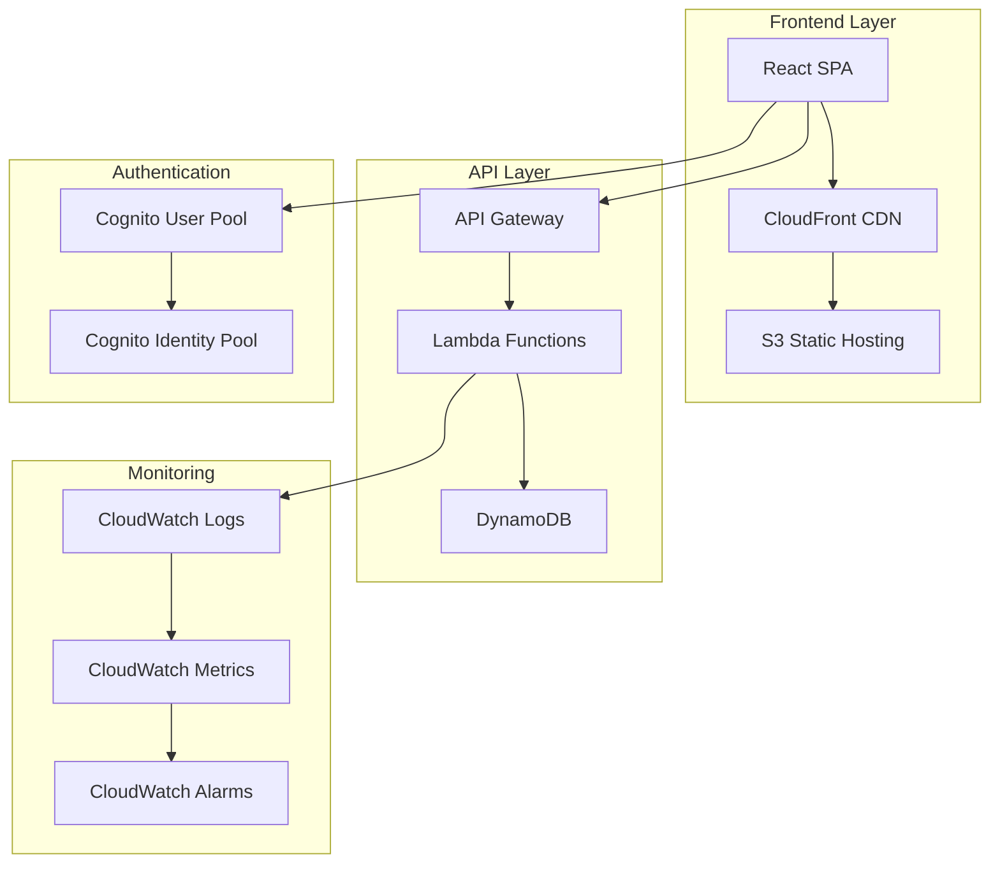

# 🚀 Serverless Web Application Workshop


Welcome to the **Serverless Web Application Workshop**! In this comprehensive hands-on session, you'll build a complete, production-ready serverless web application using modern AWS services.

## 🎯 What You'll Build

You'll create a **Task Management Application** with the following features:

### ✨ Application Features
- **User Authentication** with Amazon Cognito
- **RESTful API** with API Gateway and Lambda
- **Real-time Data** with DynamoDB
- **Static Website Hosting** with S3 and CloudFront
- **Monitoring & Logging** with CloudWatch
- **Security Best Practices** throughout

### 🏗️ Architecture Overview



## 📊 Workshop Metrics

| Metric | Target | Your Progress |
|--------|--------|---------------|
| **Duration** | 3-4 hours | ⏱️ Starting... |
| **Cost** | ~$12.50 USD | 💰 $0.00 |
| **Modules** | 6 modules | 📚 0/6 complete |
| **Hands-on Labs** | 4 labs | 🧪 0/4 complete |

## 🎓 Learning Objectives

By the end of this workshop, you will be able to:

### 🎯 **Core Objectives**
- ✅ **Design serverless architectures** using AWS best practices
- ✅ **Implement Lambda functions** with proper error handling and logging
- ✅ **Configure API Gateway** with authentication and authorization
- ✅ **Model data in DynamoDB** with efficient access patterns
- ✅ **Deploy static websites** with global CDN distribution
- ✅ **Implement security controls** following least privilege principles

### 🚀 **Advanced Objectives**
- ✅ **Optimize performance** with caching and connection pooling
- ✅ **Monitor applications** with custom metrics and alarms
- ✅ **Implement CI/CD pipelines** for serverless applications
- ✅ **Apply cost optimization** techniques for serverless workloads

## 🛠️ Technology Stack

### **Backend Services**
```yaml
Compute: AWS Lambda (Node.js 18)
API: Amazon API Gateway (REST API)
Database: Amazon DynamoDB (On-Demand)
Authentication: Amazon Cognito
Monitoring: Amazon CloudWatch
```

### **Frontend Stack**
```yaml
Framework: React 18 with TypeScript
Build Tool: Vite
UI Library: Material-UI (MUI)
State Management: React Query
Hosting: Amazon S3 + CloudFront
```

### **DevOps Tools**
```yaml
IaC: AWS CloudFormation
CLI: AWS CLI v2
Package Manager: npm
Version Control: Git
```

## 💰 Cost Breakdown

| Service | Usage | Estimated Cost |
|---------|-------|----------------|
| **Lambda** | 1M invocations | $2.00 |
| **API Gateway** | 1M requests | $1.50 |
| **DynamoDB** | 1M read/write units | $3.00 |
| **S3** | 1GB storage + requests | $1.00 |
| **CloudFront** | 1GB data transfer | $2.00 |
| **Cognito** | 1000 MAU | $1.00 |
| **Data Transfer** | Various | $2.00 |
| **Total** | | **$12.50** |

> 💡 **Cost Optimization Tip**: This workshop uses on-demand pricing. In production, consider Reserved Capacity for predictable workloads.

## 🏃‍♂️ Quick Start

### Option 1: Guided Workshop (Recommended)
Follow the step-by-step modules for a comprehensive learning experience:

1. **[Prerequisites Setup](prerequisites/)** - Environment preparation
2. **[Module 1: Serverless Backend](modules/module1/)** - Lambda + DynamoDB
3. **[Module 2: API Gateway](modules/module2/)** - REST API + Authentication
4. **[Module 3: Frontend Deployment](modules/module3/)** - React + S3 + CloudFront
5. **[Module 4: Monitoring](modules/module4/)** - CloudWatch + Alarms

### Option 2: Express Setup (Advanced Users)
Deploy the complete solution in one command:

```bash
# Clone the workshop repository
git clone https://github.com/aws-samples/serverless-workshop-studio.git
cd serverless-workshop-studio

# Deploy infrastructure
aws cloudformation create-stack \
  --stack-name serverless-workshop \
  --template-body file://templates/main-infrastructure.yaml \
  --capabilities CAPABILITY_NAMED_IAM \
  --parameters ParameterKey=EnvironmentName,ParameterValue=MyWorkshop

# Deploy application
npm install
npm run deploy
```

## 🔧 Prerequisites Checklist

Before starting, ensure you have:

### ✅ **AWS Account Setup**
- [ ] AWS Account with administrative access
- [ ] AWS CLI v2 installed and configured
- [ ] Default region set (us-east-1 recommended)

### ✅ **Development Environment**
- [ ] Node.js 18+ installed
- [ ] Git installed and configured
- [ ] Text editor (VS Code recommended)
- [ ] Terminal/Command prompt access

### ✅ **AWS Service Limits**
- [ ] Lambda concurrent executions: 1000+
- [ ] API Gateway APIs: 10+
- [ ] DynamoDB tables: 10+
- [ ] S3 buckets: 5+
- [ ] CloudFront distributions: 2+

### ✅ **Knowledge Prerequisites**
- [ ] Basic JavaScript/Node.js understanding
- [ ] Familiarity with REST APIs
- [ ] Basic AWS Console navigation
- [ ] Understanding of web application concepts

## 🎨 Workshop Features

### 🔄 **Interactive Elements**
- **Real-time cost tracking** throughout the workshop
- **Progress indicators** for each module
- **Automated validation** of your work
- **Interactive architecture diagrams**

### 📱 **Multi-Device Support**
- **Desktop optimized** for development work
- **Tablet friendly** for reading and reference
- **Mobile accessible** for quick checks

### ♿ **Accessibility Features**
- **Screen reader compatible** content
- **High contrast** code examples
- **Keyboard navigation** support
- **Alt text** for all images

## 🆘 Getting Help

### 📚 **Documentation**
- **[Workshop GitHub Repository](https://github.com/aws-samples/serverless-workshop-studio)**
- **[AWS Serverless Documentation](https://docs.aws.amazon.com/serverless/)**
- **[Troubleshooting Guide](troubleshooting/)**

### 💬 **Community Support**
- **Slack Channel**: #serverless-workshop-support
- **Office Hours**: Tuesdays 2-3 PM PST
- **GitHub Issues**: Report bugs and request features

### 🎯 **Workshop Support**
- **Email**: serverless-workshop@amazon.com
- **Response Time**: Within 24 hours
- **Languages**: English, Spanish, Portuguese

## 🚀 Ready to Start?

Choose your path:

<div class="workshop-navigation">
  <div class="nav-card">
    <h3>🎓 New to Serverless?</h3>
    <p>Start with our comprehensive prerequisites guide</p>
    <a href="prerequisites/" class="btn btn-primary">Begin Prerequisites</a>
  </div>

  <div class="nav-card">
    <h3>⚡ Experienced Developer?</h3>
    <p>Jump straight into building the backend</p>
    <a href="modules/module1/" class="btn btn-secondary">Start Module 1</a>
  </div>

  <div class="nav-card">
    <h3>🔍 Just Exploring?</h3>
    <p>Check out the architecture and code samples</p>
    <a href="architecture/" class="btn btn-outline">View Architecture</a>
  </div>
</div>

---

## 📈 Workshop Roadmap

This workshop is continuously updated with new features:

### ✅ **Current Version (2.1.0)**
- Complete serverless application
- Authentication with Cognito
- Real-time monitoring
- Cost optimization techniques

### 🔄 **Coming Soon (2.2.0)**
- GraphQL API with AppSync
- Real-time features with WebSockets
- Advanced security patterns
- Multi-region deployment

### 🎯 **Future Enhancements**
- Machine learning integration
- Event-driven architectures
- Microservices patterns
- Advanced monitoring with X-Ray

---

**💡 Pro Tip**: Bookmark this page and use the progress tracker to resume where you left off!

**🎉 Let's build something amazing together!**
