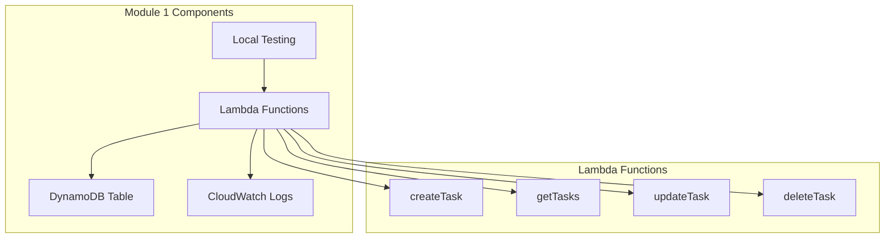

# Module 1: Serverless Backend with Lambda and DynamoDB

## 🎯 Module Overview

In this module, you'll build the core backend infrastructure for our Task Management application. You'll create a DynamoDB table to store tasks and implement Lambda functions to handle CRUD operations.

### 📋 What You'll Build
- **DynamoDB Table** with optimized schema design
- **Lambda Functions** for task management operations
- **Error Handling** and logging best practices
- **Local Testing** environment setup

### ⏱️ Estimated Time: 60 minutes

## 🏗️ Architecture for This Module



## 📚 Learning Objectives

By the end of this module, you will:
- ✅ Design efficient DynamoDB table schemas
- ✅ Implement Lambda functions with proper error handling
- ✅ Use AWS SDK v3 with best practices
- ✅ Set up local development and testing workflows
- ✅ Implement logging and monitoring

---

## 🚀 Step 1: Create DynamoDB Table

### 1.1 Understanding the Data Model

Our Task Management app will store tasks with the following structure:

```json
{
  "taskId": "task-123e4567-e89b-12d3-a456-426614174000",
  "userId": "user-987fcdeb-51a2-43d1-9c4f-123456789abc",
  "title": "Complete AWS Workshop",
  "description": "Finish the serverless workshop and deploy the application",
  "status": "IN_PROGRESS",
  "priority": "HIGH",
  "dueDate": "2024-07-01T10:00:00Z",
  "createdAt": "2024-06-17T08:30:00Z",
  "updatedAt": "2024-06-17T09:15:00Z",
  "tags": ["aws", "serverless", "workshop"]
}
```

### 1.2 Create the DynamoDB Table

```bash
# Create DynamoDB table with optimized configuration
aws dynamodb create-table \
    --table-name TasksTable \
    --attribute-definitions \
        AttributeName=taskId,AttributeType=S \
        AttributeName=userId,AttributeType=S \
        AttributeName=status,AttributeType=S \
        AttributeName=dueDate,AttributeType=S \
    --key-schema \
        AttributeName=taskId,KeyType=HASH \
    --global-secondary-indexes \
        IndexName=UserTasksIndex,KeySchema=[{AttributeName=userId,KeyType=HASH},{AttributeName=dueDate,KeyType=RANGE}],Projection={ProjectionType=ALL},ProvisionedThroughput={ReadCapacityUnits=5,WriteCapacityUnits=5} \
        IndexName=StatusIndex,KeySchema=[{AttributeName=status,KeyType=HASH},{AttributeName=dueDate,KeyType=RANGE}],Projection={ProjectionType=ALL},ProvisionedThroughput={ReadCapacityUnits=5,WriteCapacityUnits=5} \
    --provisioned-throughput \
        ReadCapacityUnits=5,WriteCapacityUnits=5 \
    --tags \
        Key=Workshop,Value=ServerlessTaskApp \
        Key=Environment,Value=Development
```

### 1.3 Verify Table Creation

```bash
# Check table status
aws dynamodb describe-table --table-name TasksTable --query 'Table.TableStatus'

# Wait for table to be active
aws dynamodb wait table-exists --table-name TasksTable

echo "✅ DynamoDB table created successfully!"
```

---

## 🔧 Step 2: Set Up Lambda Development Environment

### 2.1 Create Project Structure

```bash
# Create project directory
mkdir serverless-backend
cd serverless-backend

# Initialize npm project
npm init -y

# Install dependencies
npm install @aws-sdk/client-dynamodb @aws-sdk/lib-dynamodb uuid

# Install development dependencies
npm install --save-dev jest aws-lambda-test-utils nodemon

# Create directory structure
mkdir -p src/functions src/utils src/tests
```

### 2.2 Create Package.json Configuration

```json
{
  "name": "serverless-task-backend",
  "version": "1.0.0",
  "description": "Serverless backend for task management application",
  "main": "index.js",
  "scripts": {
    "test": "jest",
    "test:watch": "jest --watch",
    "dev": "nodemon --exec node src/local-test.js",
    "deploy": "aws cloudformation deploy --template-file template.yaml --stack-name serverless-backend --capabilities CAPABILITY_IAM"
  },
  "dependencies": {
    "@aws-sdk/client-dynamodb": "^3.350.0",
    "@aws-sdk/lib-dynamodb": "^3.350.0",
    "uuid": "^9.0.0"
  },
  "devDependencies": {
    "jest": "^29.5.0",
    "aws-lambda-test-utils": "^1.3.0",
    "nodemon": "^2.0.22"
  }
}
```

---

## 💻 Step 3: Implement Lambda Functions

### 3.1 Create Utility Functions

```javascript
// src/utils/dynamodb.js
const { DynamoDBClient } = require('@aws-sdk/client-dynamodb');
const { DynamoDBDocumentClient, PutCommand, GetCommand, UpdateCommand, DeleteCommand, QueryCommand, ScanCommand } = require('@aws-sdk/lib-dynamodb');

// Initialize DynamoDB client
const client = new DynamoDBClient({
    region: process.env.AWS_REGION || 'us-east-1'
});

const docClient = DynamoDBDocumentClient.from(client, {
    marshallOptions: {
        convertEmptyValues: false,
        removeUndefinedValues: true,
        convertClassInstanceToMap: false,
    },
    unmarshallOptions: {
        wrapNumbers: false,
    },
});

const TABLE_NAME = process.env.TABLE_NAME || 'TasksTable';

class TaskRepository {
    async createTask(task) {
        const command = new PutCommand({
            TableName: TABLE_NAME,
            Item: task,
            ConditionExpression: 'attribute_not_exists(taskId)'
        });

        try {
            await docClient.send(command);
            return task;
        } catch (error) {
            if (error.name === 'ConditionalCheckFailedException') {
                throw new Error('Task already exists');
            }
            throw error;
        }
    }

    async getTask(taskId) {
        const command = new GetCommand({
            TableName: TABLE_NAME,
            Key: { taskId }
        });

        const result = await docClient.send(command);
        return result.Item;
    }

    async getUserTasks(userId, limit = 50) {
        const command = new QueryCommand({
            TableName: TABLE_NAME,
            IndexName: 'UserTasksIndex',
            KeyConditionExpression: 'userId = :userId',
            ExpressionAttributeValues: {
                ':userId': userId
            },
            Limit: limit,
            ScanIndexForward: false // Sort by dueDate descending
        });

        const result = await docClient.send(command);
        return result.Items || [];
    }

    async updateTask(taskId, updates) {
        const updateExpression = [];
        const expressionAttributeNames = {};
        const expressionAttributeValues = {};

        Object.keys(updates).forEach(key => {
            if (key !== 'taskId') {
                updateExpression.push(`#${key} = :${key}`);
                expressionAttributeNames[`#${key}`] = key;
                expressionAttributeValues[`:${key}`] = updates[key];
            }
        });

        // Always update the updatedAt timestamp
        updateExpression.push('#updatedAt = :updatedAt');
        expressionAttributeNames['#updatedAt'] = 'updatedAt';
        expressionAttributeValues[':updatedAt'] = new Date().toISOString();

        const command = new UpdateCommand({
            TableName: TABLE_NAME,
            Key: { taskId },
            UpdateExpression: `SET ${updateExpression.join(', ')}`,
            ExpressionAttributeNames: expressionAttributeNames,
            ExpressionAttributeValues: expressionAttributeValues,
            ReturnValues: 'ALL_NEW',
            ConditionExpression: 'attribute_exists(taskId)'
        });

        try {
            const result = await docClient.send(command);
            return result.Attributes;
        } catch (error) {
            if (error.name === 'ConditionalCheckFailedException') {
                throw new Error('Task not found');
            }
            throw error;
        }
    }

    async deleteTask(taskId) {
        const command = new DeleteCommand({
            TableName: TABLE_NAME,
            Key: { taskId },
            ConditionExpression: 'attribute_exists(taskId)',
            ReturnValues: 'ALL_OLD'
        });

        try {
            const result = await docClient.send(command);
            return result.Attributes;
        } catch (error) {
            if (error.name === 'ConditionalCheckFailedException') {
                throw new Error('Task not found');
            }
            throw error;
        }
    }

    async getTasksByStatus(status, limit = 50) {
        const command = new QueryCommand({
            TableName: TABLE_NAME,
            IndexName: 'StatusIndex',
            KeyConditionExpression: '#status = :status',
            ExpressionAttributeNames: {
                '#status': 'status'
            },
            ExpressionAttributeValues: {
                ':status': status
            },
            Limit: limit
        });

        const result = await docClient.send(command);
        return result.Items || [];
    }
}

module.exports = { TaskRepository };
```

### 3.2 Create Response Utilities

```javascript
// src/utils/response.js
const createResponse = (statusCode, body, headers = {}) => {
    return {
        statusCode,
        headers: {
            'Content-Type': 'application/json',
            'Access-Control-Allow-Origin': '*',
            'Access-Control-Allow-Headers': 'Content-Type,X-Amz-Date,Authorization,X-Api-Key,X-Amz-Security-Token',
            'Access-Control-Allow-Methods': 'GET,POST,PUT,DELETE,OPTIONS',
            ...headers
        },
        body: JSON.stringify(body)
    };
};

const successResponse = (data, statusCode = 200) => {
    return createResponse(statusCode, {
        success: true,
        data
    });
};

const errorResponse = (message, statusCode = 400, errorCode = null) => {
    return createResponse(statusCode, {
        success: false,
        error: {
            message,
            code: errorCode
        }
    });
};

module.exports = {
    createResponse,
    successResponse,
    errorResponse
};
```

### 3.3 Create Task Validation

```javascript
// src/utils/validation.js
const validateTask = (task) => {
    const errors = [];

    // Required fields
    if (!task.title || task.title.trim().length === 0) {
        errors.push('Title is required');
    }

    if (!task.userId || task.userId.trim().length === 0) {
        errors.push('User ID is required');
    }

    // Title length validation
    if (task.title && task.title.length > 200) {
        errors.push('Title must be less than 200 characters');
    }

    // Description length validation
    if (task.description && task.description.length > 1000) {
        errors.push('Description must be less than 1000 characters');
    }

    // Status validation
    const validStatuses = ['TODO', 'IN_PROGRESS', 'COMPLETED', 'CANCELLED'];
    if (task.status && !validStatuses.includes(task.status)) {
        errors.push(`Status must be one of: ${validStatuses.join(', ')}`);
    }

    // Priority validation
    const validPriorities = ['LOW', 'MEDIUM', 'HIGH', 'URGENT'];
    if (task.priority && !validPriorities.includes(task.priority)) {
        errors.push(`Priority must be one of: ${validPriorities.join(', ')}`);
    }

    // Due date validation
    if (task.dueDate) {
        const dueDate = new Date(task.dueDate);
        if (isNaN(dueDate.getTime())) {
            errors.push('Due date must be a valid ISO 8601 date string');
        }
    }

    return errors;
};

const validateTaskUpdate = (updates) => {
    const errors = [];

    // Don't allow updating certain fields
    const forbiddenFields = ['taskId', 'userId', 'createdAt'];
    forbiddenFields.forEach(field => {
        if (updates.hasOwnProperty(field)) {
            errors.push(`Cannot update ${field}`);
        }
    });

    // Validate updatable fields
    const validationResult = validateTask(updates);
    errors.push(...validationResult);

    return errors;
};

module.exports = {
    validateTask,
    validateTaskUpdate
};
```

### 3.4 Implement Create Task Function

```javascript
// src/functions/createTask.js
const { v4: uuidv4 } = require('uuid');
const { TaskRepository } = require('../utils/dynamodb');
const { successResponse, errorResponse } = require('../utils/response');
const { validateTask } = require('../utils/validation');

const taskRepository = new TaskRepository();

exports.handler = async (event, context) => {
    console.log('Create Task Event:', JSON.stringify(event, null, 2));

    try {
        // Parse request body
        let requestBody;
        try {
            requestBody = JSON.parse(event.body);
        } catch (error) {
            return errorResponse('Invalid JSON in request body', 400, 'INVALID_JSON');
        }

        // Validate required fields
        const validationErrors = validateTask(requestBody);
        if (validationErrors.length > 0) {
            return errorResponse(validationErrors.join(', '), 400, 'VALIDATION_ERROR');
        }

        // Create task object
        const now = new Date().toISOString();
        const task = {
            taskId: uuidv4(),
            userId: requestBody.userId,
            title: requestBody.title.trim(),
            description: requestBody.description?.trim() || '',
            status: requestBody.status || 'TODO',
            priority: requestBody.priority || 'MEDIUM',
            dueDate: requestBody.dueDate || null,
            tags: requestBody.tags || [],
            createdAt: now,
            updatedAt: now
        };

        // Save to DynamoDB
        const createdTask = await taskRepository.createTask(task);

        console.log('Task created successfully:', createdTask.taskId);
        return successResponse(createdTask, 201);

    } catch (error) {
        console.error('Error creating task:', error);

        if (error.message === 'Task already exists') {
            return errorResponse('Task already exists', 409, 'TASK_EXISTS');
        }

        return errorResponse('Internal server error', 500, 'INTERNAL_ERROR');
    }
};
```

### 3.5 Implement Get Tasks Function

```javascript
// src/functions/getTasks.js
const { TaskRepository } = require('../utils/dynamodb');
const { successResponse, errorResponse } = require('../utils/response');

const taskRepository = new TaskRepository();

exports.handler = async (event, context) => {
    console.log('Get Tasks Event:', JSON.stringify(event, null, 2));

    try {
        const { pathParameters, queryStringParameters } = event;

        // Get single task by ID
        if (pathParameters && pathParameters.taskId) {
            const task = await taskRepository.getTask(pathParameters.taskId);

            if (!task) {
                return errorResponse('Task not found', 404, 'TASK_NOT_FOUND');
            }

            return successResponse(task);
        }

        // Get tasks with query parameters
        const userId = queryStringParameters?.userId;
        const status = queryStringParameters?.status;
        const limit = parseInt(queryStringParameters?.limit) || 50;

        let tasks = [];

        if (userId) {
            // Get tasks for specific user
            tasks = await taskRepository.getUserTasks(userId, limit);
        } else if (status) {
            // Get tasks by status
            tasks = await taskRepository.getTasksByStatus(status, limit);
        } else {
            return errorResponse('Either userId or status query parameter is required', 400, 'MISSING_QUERY_PARAM');
        }

        return successResponse({
            tasks,
            count: tasks.length,
            limit
        });

    } catch (error) {
        console.error('Error getting tasks:', error);
        return errorResponse('Internal server error', 500, 'INTERNAL_ERROR');
    }
};
```

---

## 🧪 Step 4: Local Testing Setup

### 4.1 Create Local Test Environment

```javascript
// src/local-test.js
const { handler: createTaskHandler } = require('./functions/createTask');
const { handler: getTasksHandler } = require('./functions/getTasks');

// Mock AWS Lambda event for testing
const createMockEvent = (httpMethod, path, body = null, queryStringParameters = null, pathParameters = null) => {
    return {
        httpMethod,
        path,
        body: body ? JSON.stringify(body) : null,
        queryStringParameters,
        pathParameters,
        headers: {
            'Content-Type': 'application/json'
        }
    };
};

const testCreateTask = async () => {
    console.log('\n🧪 Testing Create Task...');

    const event = createMockEvent('POST', '/tasks', {
        userId: 'user-123',
        title: 'Test Task from Local Environment',
        description: 'This is a test task created locally',
        status: 'TODO',
        priority: 'HIGH',
        dueDate: '2024-07-01T10:00:00Z',
        tags: ['test', 'local']
    });

    try {
        const result = await createTaskHandler(event, {});
        console.log('✅ Create Task Result:', JSON.parse(result.body));
        return JSON.parse(result.body).data;
    } catch (error) {
        console.error('❌ Create Task Error:', error);
    }
};

const testGetTasks = async (userId) => {
    console.log('\n🧪 Testing Get Tasks...');

    const event = createMockEvent('GET', '/tasks', null, { userId, limit: '10' });

    try {
        const result = await getTasksHandler(event, {});
        console.log('✅ Get Tasks Result:', JSON.parse(result.body));
    } catch (error) {
        console.error('❌ Get Tasks Error:', error);
    }
};

// Run tests
const runTests = async () => {
    console.log('🚀 Starting Local Tests...');

    // Test create task
    const createdTask = await testCreateTask();

    if (createdTask) {
        // Test get tasks
        await testGetTasks(createdTask.userId);
    }

    console.log('\n✅ Local tests completed!');
};

// Run if this file is executed directly
if (require.main === module) {
    runTests().catch(console.error);
}

module.exports = { runTests };
```

### 4.2 Create Jest Unit Tests

```javascript
// src/tests/createTask.test.js
const { handler } = require('../functions/createTask');

// Mock AWS SDK
jest.mock('../utils/dynamodb', () => ({
    TaskRepository: jest.fn().mockImplementation(() => ({
        createTask: jest.fn()
    }))
}));

const { TaskRepository } = require('../utils/dynamodb');

describe('Create Task Function', () => {
    let mockTaskRepository;

    beforeEach(() => {
        mockTaskRepository = new TaskRepository();
        jest.clearAllMocks();
    });

    test('should create task successfully', async () => {
        const mockTask = {
            taskId: 'test-task-id',
            userId: 'user-123',
            title: 'Test Task',
            description: 'Test Description',
            status: 'TODO',
            priority: 'MEDIUM'
        };

        mockTaskRepository.createTask.mockResolvedValue(mockTask);

        const event = {
            body: JSON.stringify({
                userId: 'user-123',
                title: 'Test Task',
                description: 'Test Description'
            })
        };

        const result = await handler(event, {});
        const body = JSON.parse(result.body);

        expect(result.statusCode).toBe(201);
        expect(body.success).toBe(true);
        expect(body.data.title).toBe('Test Task');
        expect(mockTaskRepository.createTask).toHaveBeenCalledTimes(1);
    });

    test('should return validation error for missing title', async () => {
        const event = {
            body: JSON.stringify({
                userId: 'user-123'
                // Missing title
            })
        };

        const result = await handler(event, {});
        const body = JSON.parse(result.body);

        expect(result.statusCode).toBe(400);
        expect(body.success).toBe(false);
        expect(body.error.message).toContain('Title is required');
    });

    test('should return error for invalid JSON', async () => {
        const event = {
            body: 'invalid json'
        };

        const result = await handler(event, {});
        const body = JSON.parse(result.body);

        expect(result.statusCode).toBe(400);
        expect(body.success).toBe(false);
        expect(body.error.code).toBe('INVALID_JSON');
    });
});
```

### 4.3 Run Tests

```bash
# Run unit tests
npm test

# Run tests in watch mode
npm run test:watch

# Run local integration tests
npm run dev
```

---

## ✅ Step 5: Validation and Testing

### 5.1 Test Your Implementation

Run the following commands to validate your work:

```bash
# 1. Test DynamoDB table exists
aws dynamodb describe-table --table-name TasksTable

# 2. Run unit tests
npm test

# 3. Run local integration tests
npm run dev

# 4. Test with real AWS (optional)
node -e "
const { runTests } = require('./src/local-test');
runTests().then(() => console.log('All tests passed!'));
"
```

### 5.2 Expected Outputs

**✅ Successful DynamoDB Table Creation:**
```json
{
    "Table": {
        "TableName": "TasksTable",
        "TableStatus": "ACTIVE",
        "KeySchema": [
            {
                "AttributeName": "taskId",
                "KeyType": "HASH"
            }
        ]
    }
}
```

**✅ Successful Task Creation:**
```json
{
    "success": true,
    "data": {
        "taskId": "task-123e4567-e89b-12d3-a456-426614174000",
        "userId": "user-123",
        "title": "Test Task from Local Environment",
        "description": "This is a test task created locally",
        "status": "TODO",
        "priority": "HIGH",
        "dueDate": "2024-07-01T10:00:00Z",
        "tags": ["test", "local"],
        "createdAt": "2024-06-17T10:30:00Z",
        "updatedAt": "2024-06-17T10:30:00Z"
    }
}
```

---

## 🎯 Module Summary

Congratulations! You've successfully completed Module 1. Here's what you accomplished:

### ✅ **What You Built**
- **DynamoDB Table** with optimized schema and indexes
- **Lambda Functions** for CRUD operations
- **Error Handling** and validation logic
- **Local Testing** environment
- **Unit Tests** for quality assurance

### ✅ **Key Concepts Learned**
- **DynamoDB Design Patterns** - Single table design with GSIs
- **Lambda Best Practices** - Error handling, logging, and response formatting
- **AWS SDK v3** - Modern JavaScript SDK usage
- **Testing Strategies** - Unit tests and local integration testing

### ✅ **Skills Developed**
- Serverless backend architecture
- NoSQL database modeling
- Function-as-a-Service development
- Test-driven development practices

---

## 🚀 Next Steps

You're ready to move on to **Module 2: API Gateway and Authentication**!

In the next module, you'll:
- Create REST API with API Gateway
- Implement authentication with Cognito
- Connect your Lambda functions to HTTP endpoints
- Add request/response validation

<div class="module-navigation">
  <a href="../module2/" class="btn btn-primary">Continue to Module 2 →</a>
  <a href="../../" class="btn btn-secondary">← Back to Overview</a>
</div>

---

## 📚 Additional Resources

### 🔗 **AWS Documentation**
- [DynamoDB Best Practices](https://docs.aws.amazon.com/amazondynamodb/latest/developerguide/best-practices.html)
- [Lambda Function Best Practices](https://docs.aws.amazon.com/lambda/latest/dg/best-practices.html)
- [AWS SDK for JavaScript v3](https://docs.aws.amazon.com/AWSJavaScriptSDK/v3/latest/)

### 🛠️ **Tools and Libraries**
- [DynamoDB Local](https://docs.aws.amazon.com/amazondynamodb/latest/developerguide/DynamoDBLocal.html)
- [AWS SAM CLI](https://docs.aws.amazon.com/serverless-application-model/latest/developerguide/serverless-sam-cli-install.html)
- [Jest Testing Framework](https://jestjs.io/)

### 💡 **Pro Tips**
- Use DynamoDB streams for real-time processing
- Implement connection pooling for better performance
- Consider using AWS X-Ray for distributed tracing
- Set up CloudWatch alarms for monitoring

**🎉 Great job completing Module 1! Your serverless backend is ready!**
